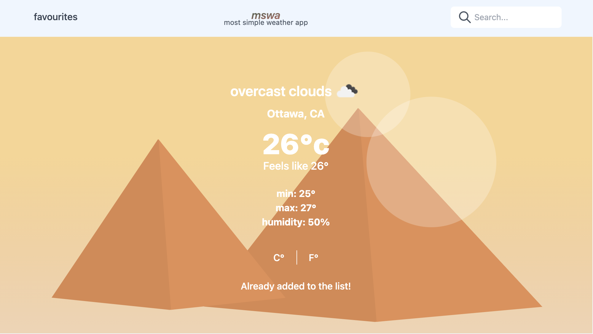

**mswa** a simple weather app.

---

# How does this work locally?

- **npm/yarn install** - Install the dependencies
- **env.local** - This file is needed in the root
  NEXT_PUBLIC_API_WEATHER
  -- You need to get an API key here https://openweathermap.org/api
- **npm/yarn dev** - To run locally
